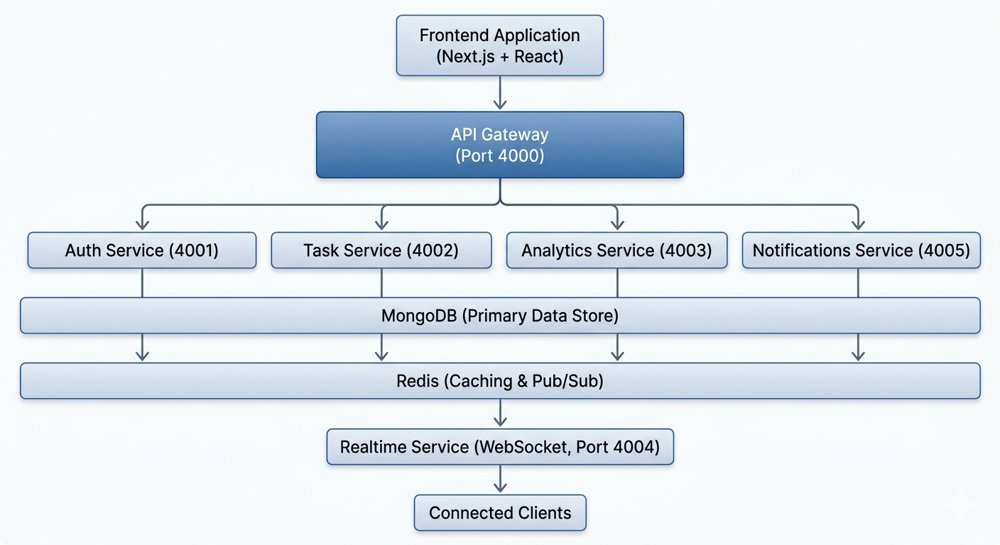

# Workstation: Production-Grade Project Management Platform

**Workstation** is a high-performance, scalable project management SaaS platform built with a modern microservices architecture. It delivers real-time collaboration, AI-powered insights, and intelligent task management for distributed engineering teams.

## Overview

Workstation is designed for engineering teams that demand reliability, performance, and scalability. The platform provides a unified interface for managing complex projects by decoupling core domains (Authentication, Task Management, Analytics, and Notifications) to ensure maximum uptime and independent service scalability.

## Core Features

### Enterprise Task Management

- Real-time synchronization with WebSocket support for instant board updates across all team members
- Complex task modeling with subtasks, priority levels, and sprint organization (Scrum-compatible)
- Persistent user preferences stored in backend (Theme, Timezone, Auto-save) for seamless cross-device experience
- Role-based access control with Admin, Project Manager, and Developer levels

### AI-Powered Workflow

- Automated task summarization using OpenAI GPT to condense descriptions into actionable items
- Intelligent subtask generation with automatic breakdown of complex tickets
- Priority suggestions with AI-driven urgency assessment based on task content and deadlines

### Real-Time Analytics Engine

- Cross-project analytics tracking team efficiency and workload distribution
- Automatic risk detection identifying overdue tasks and bottlenecked sprints
- Redis-backed performance for fast metric retrieval and cached analytics
- Weekly productivity curves and team developer efficiency metrics

### Unified Notification System

- Persistent alerts with database-backed notification tracking to ensure no status changes are missed
- Real-time system notifications for critical project events
- Multi-channel delivery for notifications

## System Architecture

Workstation utilizes an API Gateway pattern combined with an Event-Driven Broker (Redis) to coordinate between 6 specialized microservices:



### Microservice Responsibilities

1. **API Gateway** - Central entry point handling request routing, rate limiting, CORS normalization, and load distribution
2. **Auth Service** - User authentication, JWT lifecycle, identity management, and profile persistence
3. **Task Service** - Core domain logic for tasks, projects, and sprints with Redis caching for high-performance reads
4. **Notification Service** - Persistent user alerts and system notifications with delivery tracking
5. **Analytics Service** - Real-time KPI computation and materialized analytics for dashboard visualizations
6. **Realtime Service** - WebSocket server bridging Redis Pub/Sub events to connected browser clients

## Technical Stack

### Frontend

- Next.js 15 with App Router and Turbopack for ultra-fast builds
- React 19 with modern hooks and functional components
- Tailwind CSS v4 with native dark mode support
- TypeScript for type safety across the application
- Cypress for end-to-end testing

### Backend

- Node.js with Express for high-concurrency service implementations
- MongoDB with Mongoose ODM for flexible document-based persistence
- Redis for high-speed caching and inter-service event messaging
- TypeScript shared type definitions to prevent contract drift
- JWT authentication with 7-day expiration
- Zod for runtime schema validation

## Production Readiness

### Containerization

- Multi-stage Dockerfiles for optimized production builds
- .dockerignore files configured for all services to reduce build context
- Layer caching enabled for faster iterative builds

### Database

- MongoDB connection pooling for efficient resource utilization
- Compound indexes on frequently queried fields (email, userId, projectId)
- TTL indexes for automatic notification cleanup

### Caching Strategy

- Redis caching for analytics queries with 5-minute TTL
- Cache invalidation on task status changes
- Distributed session storage across service instances

### Security

- JWT-based authentication with secure token generation
- Bcrypt password hashing with 10 salt rounds
- CORS protection on all service endpoints
- Rate limiting (100 requests per minute per IP)
- Input validation with Zod schemas
- XSS and SQL injection prevention

## Getting Started

### Prerequisites

- Node.js 18 or higher
- MongoDB 5.0 or higher
- Redis 6.0 or higher
- Docker and Docker Compose (optional, for containerized deployment)

### Installation

1. Clone the repository

```bash
git clone <repository-url>
cd projects
```

2. Install dependencies

```bash
npm install

# Install frontend dependencies
cd frontend && npm install && cd ..

# Install backend dependencies
cd backend && npm install && cd ..
```

3. Configure environment variables

Create `.env.local` in the frontend directory:

```
NEXT_PUBLIC_API_BASE_URL=http://localhost:4000
```

Create `.env` in the backend directory:

```
PORT=4000
MONGO_URI=mongodb://localhost:27017/workstation-tasks
REDIS_URL=redis://localhost:6379
JWT_SECRET=your-secret-key-here
OPENAI_API_KEY=your-openai-api-key
NODE_ENV=development
```

4. Seed test data (optional)

```bash
cd backend
npx ts-node seed-data.ts
```

This will create test users, projects, sprints, and historical task data for analytics demonstration.

### Running the Application

**Option 1: Docker Compose (Recommended)**

```bash
docker-compose up -d
```

Services will be available at:

- Frontend: http://localhost:3000
- API Gateway: http://localhost:4000
- MongoDB: localhost:27017
- Redis: localhost:6379

**Option 2: Manual Development Setup**

Terminal 1 - Start MongoDB and Redis:

```bash
mongod --dbpath ./data/db
# In another terminal
redis-server
```

Terminal 2 - Start backend services:

```bash
cd backend
npm run dev
```

Terminal 3 - Start frontend:

```bash
cd frontend
npm run dev
```

Application will be accessible at http://localhost:3000

## Demo Accounts

After seeding the database, use these credentials:

| Name          | Email                  | Role            | Password  |
| ------------- | ---------------------- | --------------- | --------- |
| Sanket K      | sanket@workstation.app | Admin           | We@reDev9 |
| Vyom K        | vyom@workstation.app   | Admin           | We@reDev9 |
| John Doe      | john@workstation.app   | Project Manager | We@reDev9 |
| Lina Chen     | lina@workstation.app   | Developer       | We@reDev9 |
| Marcus Patel  | marcus@workstation.app | Developer       | We@reDev9 |
| Jane Smith    | jane@workstation.app   | Project Manager | We@reDev9 |
| David Kim     | david@workstation.app  | Developer       | We@reDev9 |
| Sarah Johnson | sarah@workstation.app  | Developer       | We@reDev9 |

## API Reference

### Authentication Endpoints

- POST /auth/login - User login
- POST /auth/register - User registration
- GET /auth/me - Get current user profile
- PATCH /auth/me - Update user profile

### User Management (Admin Only)

- GET /auth/users - List all users
- POST /auth/users - Create system user
- GET /auth/users/:id - Get user details
- PATCH /auth/users/:id - Update user
- DELETE /auth/users/:id - Delete user
- POST /auth/users/:id/reset-password - Reset user password

### Task Management

- GET /tasks - List tasks (filtered by user permissions)
- POST /tasks - Create new task
- GET /tasks/:id - Get task details
- PUT /tasks/:id - Update task
- PATCH /tasks/:id/status - Update task status
- DELETE /tasks/:id - Delete task

### Project Management

- GET /projects - List projects (user has access to)
- POST /projects - Create project
- PATCH /projects/:id - Update project
- POST /projects/:id/members - Add team developer
- DELETE /projects/:id/members/:email - Remove team developer

### Sprint Management

- GET /sprints - List sprints
- POST /sprints - Create sprint
- PATCH /sprints/:id - Update sprint

### Analytics

- GET /analytics/summary - Get team productivity summary with weekly completion data

## Project Structure

```
projects/
├── frontend/
│   ├── src/
│   │   ├── app/              # Next.js App Router pages
│   │   ├── components/       # Reusable React components
│   │   ├── lib/              # Utility functions and API clients
│   │   └── types/            # TypeScript type definitions
│   ├── cypress/              # End-to-end test suites
│   ├── package.json
│   └── tsconfig.json
├── backend/
│   ├── api-gateway/          # Request routing and middleware
│   ├── auth-service/         # User authentication and management
│   ├── task-service/         # Task, project, and sprint management
│   ├── analytics-service/    # Team analytics and reporting
│   ├── notification-service/ # Notification delivery system
│   ├── realtime-service/     # WebSocket support for real-time updates
│   ├── seed-data.ts          # Database seeding script
│   ├── package.json
│   └── tsconfig.base.json
├── docker-compose.yml        # Multi-container orchestration
├── .env.example              # Example environment variables
└── README.md                 # This file
```

## Testing

### Unit and Integration Tests

```bash
cd backend
npm test
```

### End-to-End Tests

```bash
cd frontend

# Run tests in headless mode
npm run cy:run

# Open interactive test runner
npm run cy:open
```

## Development Workflow

1. Create a feature branch from main
2. Make code changes and test locally
3. Run linting and type checks
4. Execute test suite to ensure code quality
5. Submit pull request with clear description
6. Address code review feedback
7. Merge after approval

## Performance Characteristics

- Frontend build time: <3 seconds with Turbopack
- API response latency: <50ms (avg) with caching
- Analytics query caching: 5-minute TTL with automatic invalidation
- Database query optimization: Compound indexes on high-cardinality fields
- Real-time update latency: <100ms through WebSocket

## Monitoring

Log output from all services is directed to stdout in JSON format for easy parsing and integration with centralized logging systems. In production, integrate with:

- AWS CloudWatch for cloud deployments
- ELK Stack for self-hosted environments
- Sentry for error tracking and alerting
- Prometheus and Grafana for metrics visualization

## Deployment

### Docker Deployment

```bash
# Build all service images
docker-compose build

# Start all services
docker-compose up -d

# View logs
docker-compose logs -f

# Stop services
docker-compose down
```

### Production Environment Variables

```
NODE_ENV=production
MONGO_URI=<production-mongodb-connection-string>
REDIS_URL=<production-redis-connection-string>
JWT_SECRET=<strong-random-secret-key>
OPENAI_API_KEY=<your-openai-api-key>
NEXT_PUBLIC_API_BASE_URL=<production-api-domain>
```

## Common Issues and Solutions

**MongoDB Connection Error**

Verify MongoDB is running on port 27017 or update MONGO_URI in .env file.

**Redis Connection Error**

Verify Redis is running on port 6379 or update REDIS_URL in .env file.

**Port Already in Use**

Change port numbers in service configuration or terminate existing processes using those ports.

**Authentication Failures**

Clear browser localStorage and retry login with correct credentials.

**Seed Data Not Showing**

Ensure MongoDB is running and the seed script completed successfully. Check for error messages in the console output.

## Future Enhancements

- Gantt chart visualization for project timelines
- Advanced filtering and full-text search capabilities
- File attachment support with cloud storage integration
- Slack and Microsoft Teams integration for notifications
- Time tracking and effort estimation features
- Custom workflow automation and conditional logic
- GraphQL API as alternative to REST
- Mobile native applications for iOS and Android
- Export to PDF and Excel formats
- Integration with popular CI/CD platforms

## Contributing

1. Follow existing code style and architectural patterns
2. Write tests for new features
3. Update documentation as needed
4. Use meaningful and descriptive commit messages
5. Keep pull requests focused and easy to review
6. Ensure all tests pass before submitting PR

## Support

For issues, questions, or feedback, contact the development team or open an issue in the project repository.

## Team

Developed with a focus on quality, performance, and user experience by the Workstation engineering team.

## License

Proprietary - All rights reserved
